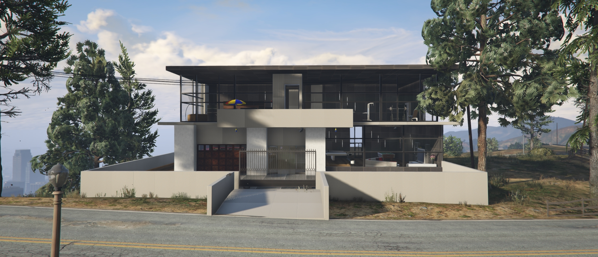
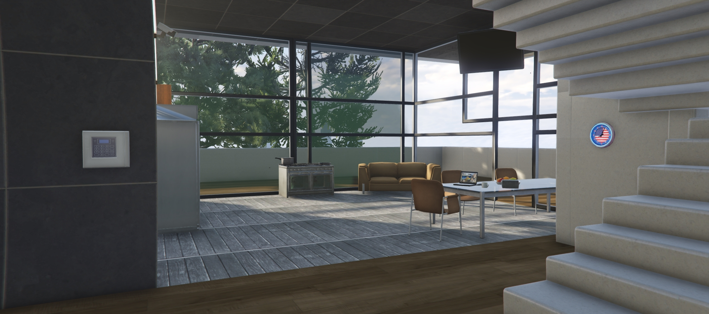
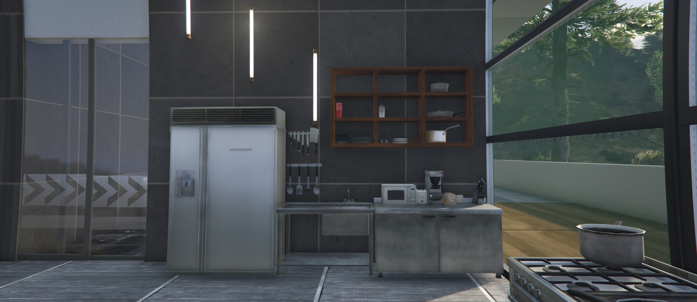
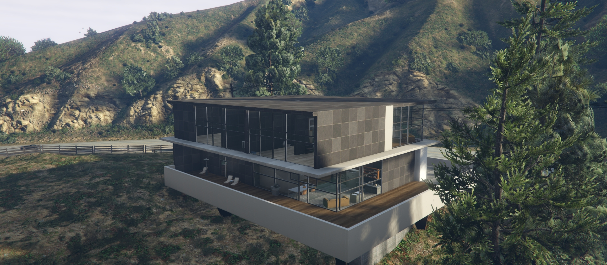

# LuxorVilla - Luxury White-Styled Villa in VineWood

## Description

LuxorVilla is a luxurious, white-styled villa located in the upscale VineWood area of your FiveM server. This Ymap MLO (Map Editor) resource adds an exquisite mansion to your server, perfect for roleplay, private events, or just enjoying the high life in VineWood.

## Features

- Stunning, high-end villa with a modern, white-themed design.
- Multiple rooms and areas to explore and utilize.
- Ideal for roleplay scenarios, VIP events, or as a player hangout.
- Detailed landscaping and surroundings for a realistic atmosphere.
- Easy integration into your FiveM server using the Ymap format.

## Installation

1. Download the VineVilla resource.
2. Extract the contents of the ZIP file.
3. Place the `LuxorVilla` folder into your FiveM server's `resources` directory.
4. Add `ensure LuxorVilla` to your server.cfg file.
5. Restart your FiveM server.

# Screenshots

